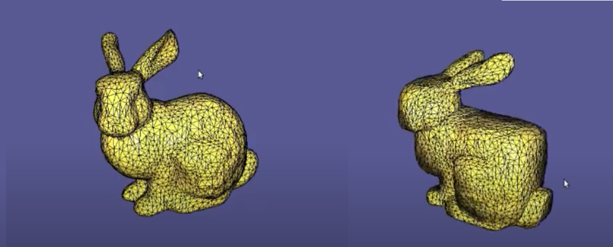
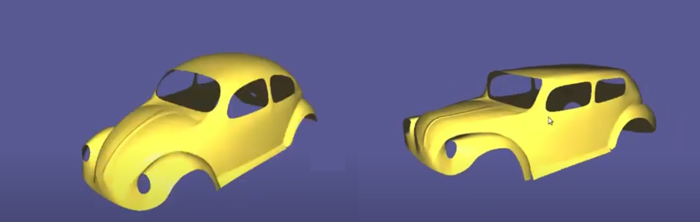

# Cubic stylization implementation

### How to run
Implementation of cubic stylization algorithm using Libigl C++ library. 

Boilerplate CMake/build files from the introduction assignment is used:
https://github.com/alecjacobson/geometry-processing-introduction

Commands to build:
mkdir build
cd build
cmake .. -DCMAKE_BUILD_TYPE=Release
make

Link to paper: https://www.dgp.toronto.edu/projects/cubic-stylization/cubicStyle_high.pdf

Run with command line arguments, file name and starting lambda value:
`cubicstyle ../data/myfileName.off 0.15`

Controls: Press "s" to decrease lambda (less cube-like), "S" to increase lambda (more cube-like).

### Description
The cubic stylization algorithm takes a 3d mesh as input, and outputs a deformation of that mesh such that the mesh gains cube-like features while retaining details and the overall structure of the original mesh. It can be used to stylize 3d models for artistic applications. The algorithm achieves this by minimizing the energy in Equation 1 of the paper.

The first term is the As-rigid-as-possible (ARAP) energy which is minimized if the deformation of each edge of the mesh is rigid (a rotation and translation). This encourages the outputted deformation to retain its original details (ex. as a viewer, the deformations would look like they are translations or rotations on some parts of the mesh; not stretching or strange distortions).

The second term is responsible for the cube stylization. This term uses the L1 norm of the rotated normals, which is minimized by having normals facing one of the coordinate axises (ex. the normals are aligned with one of the 3 axises, x, y, z). By doing so, the deformed mesh will have most of its normals aligned with a coordinate axis; then most of the faces on the mesh would be either parallel or orthogonal to each other, making the mesh "cube-like".

The algortihm is iterative; at each iteration, the first and second term are alternately minimized. A local minimization and global minimization is used for finding a rotation and finding the deformed vertices respectively. 

### Implementation
<b>cubic_style_precomputation.cpp</b> 
* Computations that can be done just once (i.e. before any iterations) is done in this function, such as cotangent weights, mass matrix, and normals

<b>cubic_style_data.h</b> 
* contains the results of `cubic_style_precomputation` and data that is used throughout iterations

<b>cubic_style_single_iteration.cpp</b>
* performs a single iteration of the algorithm. Outputs the deformed mesh, and updates the data in `cubic_style_data.h` to be used in the next iteration
* performs local step using ADMM method described in the paper
* performs global step with LibIgl ARAP functions and Eigen library solvers

<b>main.cpp</b>: 
* Initializes the input mesh and lambda value according to user input/default values.
* Runs `cubic_style_precomputation` on the input mesh. 
* Listens to key presses; when "s" or "S" is pressed, it will run `cubic_style_single_iteration` a fixed number of times on the input mesh with the updated value of lambda, and then sets the new mesh data on the LibIgl viewer

Note: Currently, the code just uses a hard coded number for the number of iterations; better stopping conditions are described in the paper.

### Examples
 
 

